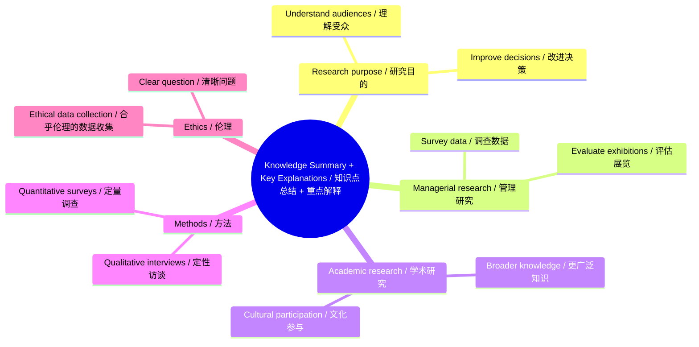

# Example Output

## Sample Reading Bilingual Mind Map / 示例阅读中英对照思维导图

# Full Bilingual Reading / 全篇中英对照阅读

**English**

Research helps cultural organizations understand audiences（受众） and improve decisions. A manager may collect survey data（调查数据） to evaluate a new exhibition, while an academic researcher may study the same exhibition to develop broader knowledge about cultural participation（文化参与）.

**中文**

研究帮助文化组织理解受众并改进决策。管理者可能会收集调查数据来评估一个新展览，而学术研究者可能会研究同一个展览，以发展关于文化参与的更广泛知识。

**English**

Qualitative interviews（定性访谈） can reveal how visitors describe their experience. Quantitative surveys（定量调查） can measure how many visitors intend to return. Both approaches are useful when the research question（研究问题） is clear and the data are collected ethically（合乎伦理地）.

**中文**

定性访谈可以揭示参观者如何描述自己的体验。定量调查可以衡量有多少参观者打算再次到访。当研究问题清晰且数据收集符合伦理时，这两种方法都有用。

## References

Example Author, A. (2026). Understanding cultural participation. Journal of Example Studies, 1(1), 1-10.

# Flashcards / 双语记忆卡

**Q / English:** What can research help cultural organizations do?

**问 / 中文：** 研究可以帮助文化组织做什么？

**A / English:** Research can help cultural organizations understand audiences and improve decisions.

**答 / 中文：** 研究可以帮助文化组织理解受众并改进决策。

**Q / English:** What is the difference between qualitative interviews and quantitative surveys in this example?

**问 / 中文：** 在这个例子中，定性访谈和定量调查有什么区别？

**A / English:** Qualitative interviews reveal how visitors describe experience, while quantitative surveys measure how many visitors intend to return.

**答 / 中文：** 定性访谈揭示参观者如何描述体验，而定量调查衡量有多少参观者打算再次到访。

# Chinese Summary / 中文摘要

这段示例说明，研究可以帮助文化组织理解受众并改进决策。管理研究更偏向评估具体项目，学术研究更关注形成关于文化参与的广泛知识。定性访谈和定量调查各有作用，但都需要清晰的研究问题和合乎伦理的数据收集。

# Section Notes / 章节笔记

### Sample Reading

- 页码/位置：示例文本
- 本节目的：说明管理研究、学术研究、定性方法和定量方法的基本区别。
- 中文摘要：文化组织可以用研究理解受众、评估展览并形成知识。
- 核心论点：研究方法应服务于清晰的问题，并以合乎伦理的方式收集数据。
- 关键证据：示例对比了调查、访谈、管理评估和学术研究。
- 与全文论点的关系：它展示了本 Skill 输出中需要保留的核心学习结构。

# Glossary / 术语表

| English term | 中文翻译 | Meaning in this text | 位置 |
|---|---|---|---|
| audience | 受众 | cultural organization wants to understand visitors or participants | paragraph 1 |
| survey data | 调查数据 | data collected to evaluate a new exhibition | paragraph 1 |
| qualitative interviews | 定性访谈 | interviews used to understand visitor experience | paragraph 2 |
| quantitative surveys | 定量调查 | surveys used to measure visitor intention | paragraph 2 |

# Long Sentence Analysis / 长难句分析

### Sentence 1

**Original**

A manager may collect survey data to evaluate a new exhibition, while an academic researcher may study the same exhibition to develop broader knowledge about cultural participation.

**主句**

A manager may collect survey data.

**从句和修饰成分**

`while an academic researcher...` creates a contrast between managerial and academic research purposes.

**逻辑关系**

对比关系：管理者关注项目评估，学术研究者关注更广泛的知识生产。

**中文翻译**

管理者可能会收集调查数据来评估一个新展览，而学术研究者可能会研究同一个展览，以发展关于文化参与的更广泛知识。

**Simplified English**

Managers use data for decisions, while academics use research to build knowledge.
